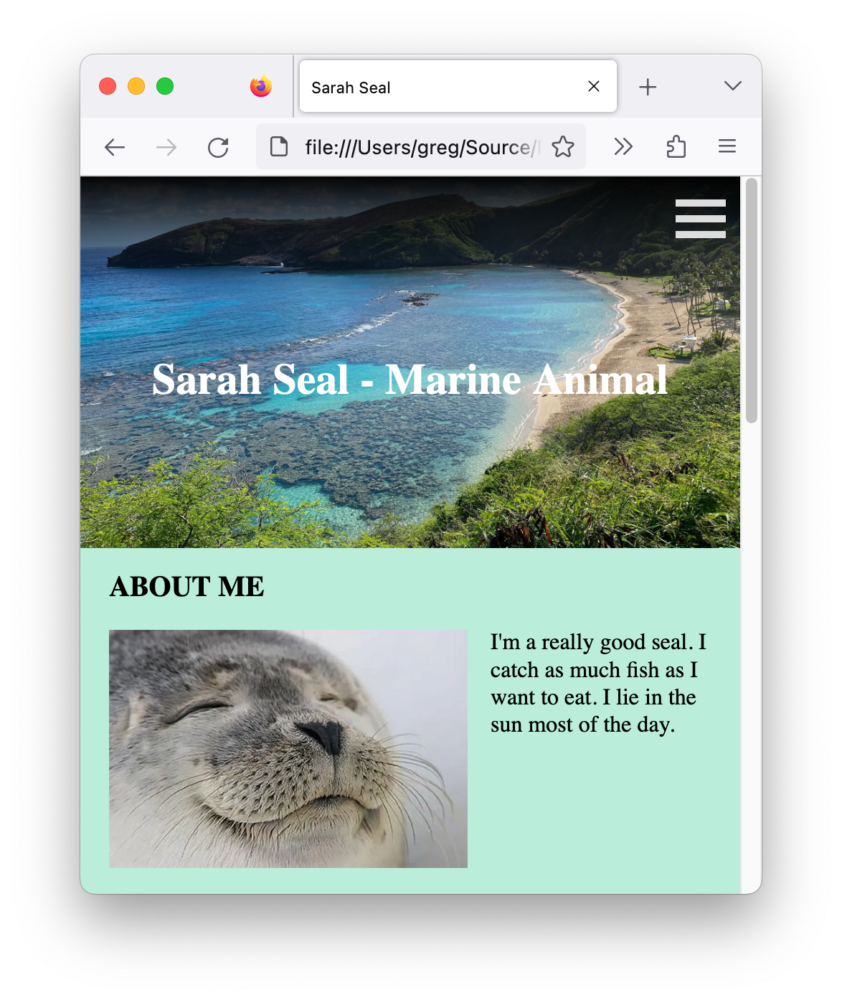

# JetBrains Academy Portfolio Project

An example of a passing solution to the final phase of the JetBrains Academy Frontend Core Portfolio project.

## Description

This project is a web page that displays a profile page for a user.
</br>


The web page includes responsive behavior.
</br>


The web page has semantic elements defining its structure. The web page also includes modal pop ups to display additional information.

## Notes

The relative directory structure was kept the same as the one used in my JetBrains Academy solution. The solution is the same as when it passed its final test except for one change to the CSS file. The following line was adjusted to use proper percentage values:

```css
background: linear-gradient(to bottom, rgba(0 0 0 / 0.98%) 0%, rgba(0 0 0 / 0%) 100%);
```

The project uses a CSS only animation for the hamburger icon when in small screen mode.

The project uses [Stylelint](https://stylelint.io/) for CSS linting with the [Recess* Property Order](https://github.com/stormwarning/stylelint-config-recess-order) plugin to ensure consistent ordering of the CSS properties. Most of the CSS standards are from [@mdo's Code Guide](https://codeguide.co/#css-syntax).

JavaScript is done in the [JavaScript Standard Style](https://standardjs.com/).

The main picture was taken by me. The other pictures were gathered from the Internet.
